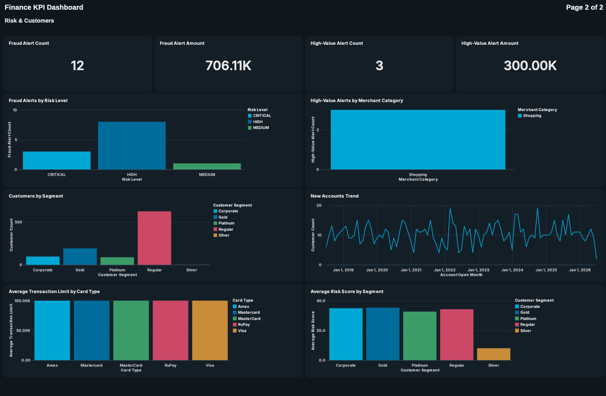
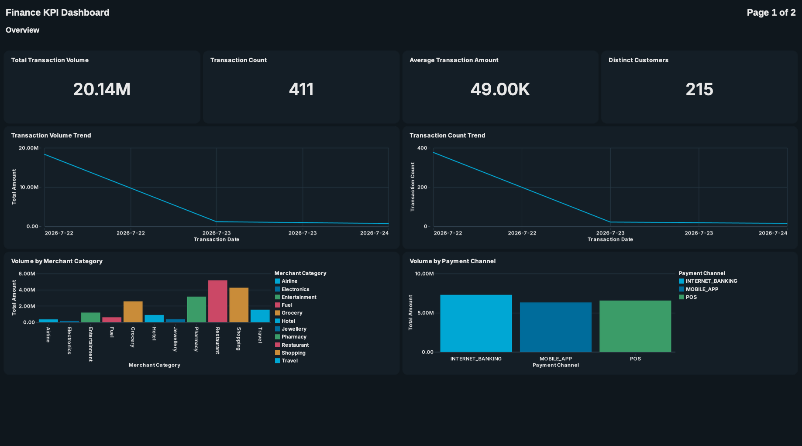
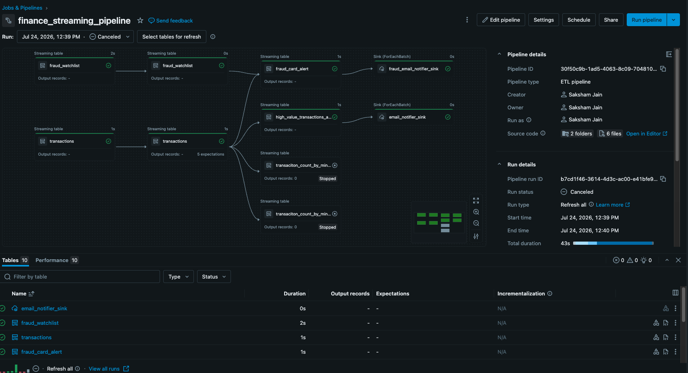
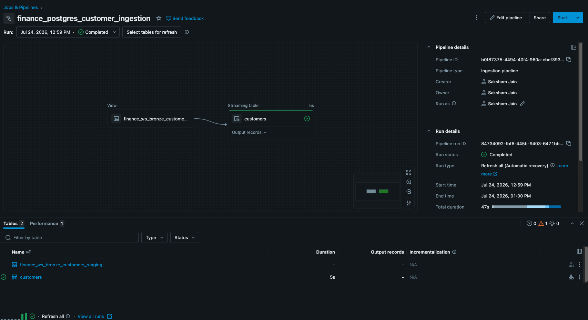

# 💳 CardWatch

### Real-Time Credit Card Fraud Detection Platform

*Detecting fraudulent transactions within seconds — not hours.*

[](#)
[](#)
[](#)
[](#)
[](#)

</div>

---

## 📖 Table of Contents

- [Overview](#-overview)
- [Business Use Case](#-business-use-case)
- [Business Problem](#-business-problem)
- [Features](#-features)
- [Medallion Architecture](#-medallion-architecture)
- [Fraud Rules](#-fraud-rules)
- [Tech Stack](#-tech-stack)

---

## 🔎 Overview

**CardWatch** is an end-to-end real-time fraud detection platform built on the **Databricks Lakehouse Platform**. It continuously ingests live credit card transactions from **Apache Kafka**, fraud watchlists from streaming JSON files, and customer master data from **PostgreSQL** to identify fraudulent activity within seconds.

The solution demonstrates enterprise-scale streaming architecture using **Spark Structured Streaming**, **Lakeflow Declarative Pipelines**, **Delta Lake**, **Unity Catalog**, **Auto Loader**, and **Lakeflow Connect** — following the **Medallion Architecture**.

<div align="center">

</div>

---

## 🏦 Business Use Case

CardWatch is a real-time credit card fraud detection platform that identifies fraudulent transactions within seconds, helping financial institutions reduce fraud losses and improve customer protection.

### Background

- Financial institutions process millions of credit card transactions daily across ATMs, POS terminals, online payment gateways, and mobile banking.
- Fraud intelligence is continuously received from internal fraud teams and external security partners.
- Delayed fraud detection can lead to financial losses and poor customer experience.

### ⚠️ Problem

- Fraudulent transactions must be detected in near real time.
- Fraud indicators arrive from multiple sources, including live transactions, fraud watchlists, and customer master data.
- Traditional batch processing cannot react quickly enough to prevent fraudulent activity.

### ✅ Solution

- Stream real-time credit card transactions from **Confluent Kafka** using **Spark Structured Streaming**.
- Continuously ingest fraud watchlist updates from JSON files using **Databricks Auto Loader**.
- Enrich transactions with customer master data from **PostgreSQL** using **Lakeflow Connect**.
- Apply **stream-stream joins**, **stream-static joins**, and **window-based analytics** to detect fraudulent and high-value transactions.
- Generate real-time **email alerts** and **interactive dashboards** for operational monitoring.

---

## 🎯 Business Problem

Exactly what a bank faces:

| Challenge | Impact |
|---|---|
| 📈 Millions of transactions every day | Requires scalable, distributed processing |
| ⏱️ Fraud must be detected within seconds | Rules out slow, manual review cycles |
| 🐢 Batch processing is too slow | Fraud propagates before it's caught |
| 🔄 Fraud intelligence continuously changes | Static rule sets quickly go stale |
| 📊 Operations teams require live dashboards | Visibility must be real-time, not next-day |

---

## ✨ Features

| | Feature |
|---|---|
| ✅ | Real-time transaction ingestion |
| ✅ | Streaming fraud watchlist ingestion |
| ✅ | Batch customer ingestion |
| ✅ | Stream-Static Join |
| ✅ | Stream-Stream Join |
| ✅ | Watermarking |
| ✅ | Tumbling Windows |
| ✅ | Sliding Windows |
| ✅ | Declarative Data Quality |
| ✅ | Delta Lake |
| ✅ | Unity Catalog |
| ✅ | Email Notifications |
| ✅ | Real-time Dashboard |

---

## 🏗️ Medallion Architecture

```
🥉 BRONZE                    🥈 SILVER                    🥇 GOLD
─────────────                ─────────────                 ─────────────
Raw Kafka events      →      Parsing                →      Fraud Alerts
Raw JSON files         →     Cleaning                →     High Value Alerts
Raw Customer Data      →     Standardisation         →     Window Aggregations
                              Data Quality
                              Type Conversions
```

<table>
<tr>
<th>🥉 Bronze</th>
<th>🥈 Silver</th>
<th>🥇 Gold</th>
</tr>
<tr>
<td valign="top">

- Raw Kafka events
- Raw JSON files
- Raw Customer Data

</td>
<td valign="top">

- Parsing
- Cleaning
- Standardisation
- Data Quality
- Type conversions

</td>
<td valign="top">

- Fraud Alert
- High Value Alert
- Window Aggregations

</td>
</tr>
</table>

---

## 🚨 Fraud Rules

### 1️⃣ Fraud Card Detection — *Stream-Stream Join*

```
   Transactions
        │
        │  INNER JOIN
        ▼
   Fraud Watchlist
```

**Uses:**
- Watermarks
- Event Time
- Late Data Handling

### 2️⃣ High Value Transaction — *Stream-Static Join*

```
   Transactions
        │
        │  LEFT JOIN
        ▼
    Customers
        │
        ▼
Amount > Customer Limit
```

---
📸 Screenshots
📊 Dashboards
<table> <tr> <td width="50%" valign="top"> <p align="center"><b>Fraud &amp; Transaction Overview</b></p>  </td> <td width="50%" valign="top"> <p align="center"><b>Operational Monitoring</b></p>  </td> </tr> </table>
🔀 Pipelines
<table> <tr> <td width="50%" valign="top"> <p align="center"><b>Kafka Streaming Pipeline</b></p>  </td> <td width="50%" valign="top"> <p align="center"><b>PostgreSQL Ingestion Pipeline (Lakeflow Connect)</b></p>  </td> </tr> </table>
---
## 🛠️ Tech Stack

| Layer | Technology |
|---|---|
| Streaming Ingestion | Apache Kafka (Confluent) |
| File Ingestion | Databricks Auto Loader |
| Database Ingestion | Lakeflow Connect (PostgreSQL) |
| Processing Engine | Apache Spark Structured Streaming |
| Storage Format | Delta Lake |
| Pipeline Orchestration | Lakeflow Declarative Pipelines |
| Governance | Unity Catalog |
| Alerting | Real-time Email Notifications |
| Monitoring | Interactive Dashboards |

---

<div align="center">

**Built on the Databricks Lakehouse Platform** 🧱

</div>
