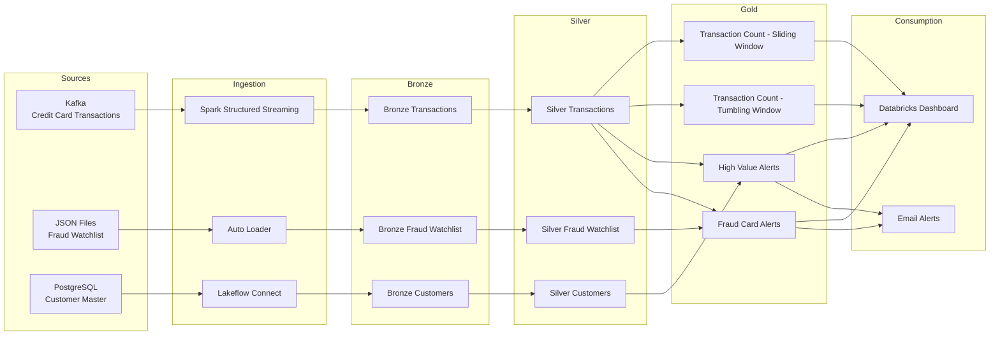

# CardWatch

## Real-Time Credit Card Fraud Detection Platform

Databricks • Apache Spark Structured Streaming • Delta Lake • Apache Kafka • Lakeflow • Unity Catalog

CardWatch is an end-to-end real-time fraud detection platform built on the Databricks Lakehouse Platform. It continuously ingests live credit card transactions from Apache Kafka, fraud watchlists from streaming JSON files, and customer master data from PostgreSQL to identify fraudulent activity within seconds.

The solution demonstrates enterprise-scale streaming architecture using Spark Structured Streaming, Lakeflow Declarative Pipelines, Delta Lake, Unity Catalog, Auto Loader, and Lakeflow Connect following the Medallion Architecture.

# Business Problem

Exactly what a bank faces.

    •Millions of transactions every day

    •Fraud must be detected within seconds

    •Batch processing is too slow

    •Fraud intelligence continuously changes

    •Operations teams require live dashboards
